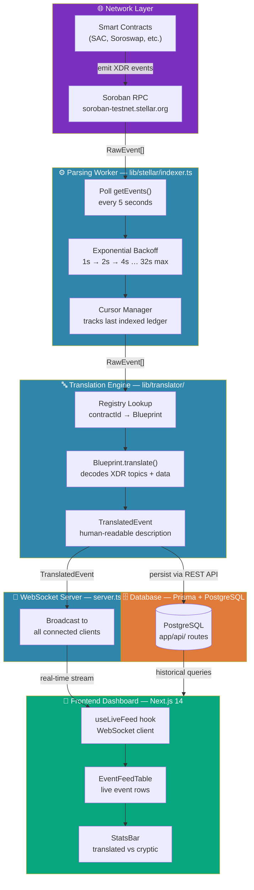

# Contributing to Open-Audit

Open-Audit is the "Google Translate for Soroban" — it transforms cryptic on-chain smart contract events into human-readable sentences for the Stellar ecosystem.

**Detailed guides:**
- [Translation Blueprint Authoring](../CONTRIBUTING.md) — how to add support for a new contract
- [System Architecture](../ARCHITECTURE.md) — deep-dive into every component

---

## Quick Setup

A working local environment in 3 steps:

```bash
# 1 — Clone and install dependencies
git clone https://github.com/coderolisa/Open-Audit.git && cd Open-Audit && npm install

# 2 — Configure environment (testnet defaults, no changes required)
cp .env.example .env.local

# 3 — Start the development server with WebSocket support
npm run dev:ws
```

Open **http://localhost:3000/dashboard** — the live event feed will begin streaming from Stellar testnet.

---

## Data Lifecycle

How a single smart contract event travels from the Stellar network to your screen:



---

## Coding Standards

These rules are enforced by ESLint and TypeScript — CI will fail if they are violated. See [CODE_STANDARDS.md](../CODE_STANDARDS.md) for the full reference.

### Function declarations

Use standard function declarations for all top-level definitions. Arrow functions are only allowed as inline callbacks.

```typescript
// ✅ Correct
function translateEvent(event: RawEvent): TranslationResult | null { ... }

// ❌ Incorrect
const translateEvent = (event: RawEvent): TranslationResult | null => { ... }
```

ESLint rule: `"func-style": ["error", "declaration"]`

### No `any` types

```typescript
// ✅ Correct
function processData(data: RawEvent): TranslatedEvent { ... }

// ❌ Incorrect
function processData(data: any): any { ... }
```

ESLint rule: `"@typescript-eslint/no-explicit-any": "error"`

### Interfaces vs type aliases

Use `interface` for object shapes. Use `type` for unions and primitives.

```typescript
interface RawEvent { id: string; contractId: string; ... }   // ✅
type TranslationStatus = "translated" | "cryptic";           // ✅
type RawEvent = { id: string; ... };                         // ❌
```

### Naming conventions

| Entity | Convention | Example |
|---|---|---|
| React components | PascalCase | `EventFeedTable` |
| Functions | camelCase | `translateEvent` |
| Interfaces | PascalCase | `RawEvent` |
| Constants | SCREAMING_SNAKE_CASE | `MAX_EVENTS_PER_PAGE` |
| Component files | PascalCase | `EventFeedTable.tsx` |
| Utility files | kebab-case | `registry.ts` |

### Other rules

- One component per file; keep files under 300 lines
- Absolute imports via the `@/` alias; no default exports from utility files
- Run `npm run format` (Prettier) before every commit

---

## Commit Format

```
<type>(<scope>): <imperative description>
```

| Type | When to use |
|---|---|
| `feat` | New feature or translation blueprint |
| `fix` | Bug fix |
| `docs` | Documentation only |
| `refactor` | Code restructuring, no behaviour change |
| `test` | Adding or improving tests |
| `chore` | Dependency updates, config changes |

**Rules:** max 72 characters · present tense · no trailing period

```
feat(translator): add Soroswap Router swap blueprint
fix(indexer): handle empty topics array in SAC burn event
docs(contributing): add end-to-end lifecycle diagram
test(translator): add edge cases for decodeAmount with zero
```

---

## PR Procedures

1. **Branch** off `main` using a prefix that matches your commit type:
   ```
   feat/soroswap-router-blueprint
   fix/sac-burn-empty-topics
   docs/lifecycle-diagram
   ```

2. **Run the full quality check** before opening a PR:
   ```bash
   npm test && npx tsc --noEmit && npm run lint
   ```

3. **PR title** follows the same `<type>(<scope>): <description>` format (max 72 chars).

4. **PR description** must include `Closes #ISSUE_NUMBER` so the issue is linked automatically.

5. **CI runs automatically** on every PR:
   - `validate-registry.yml` — validates translation registry schema
   - `codeql.yml` — static security analysis
   - `security-scan.yml` — dependency vulnerability scan

All checks must pass before a PR is eligible for review.

---

## Pre-PR Checklist

- [ ] `npm test` passes
- [ ] `npx tsc --noEmit` passes (no TypeScript errors)
- [ ] `npm run lint` passes (no ESLint errors)
- [ ] `npm run format` run (code is Prettier-formatted)
- [ ] PR title uses the correct `<type>(<scope>):` prefix
- [ ] PR description contains `Closes #ISSUE_NUMBER`
- [ ] No `any` types introduced
- [ ] All new top-level functions use standard declarations, not arrow functions
